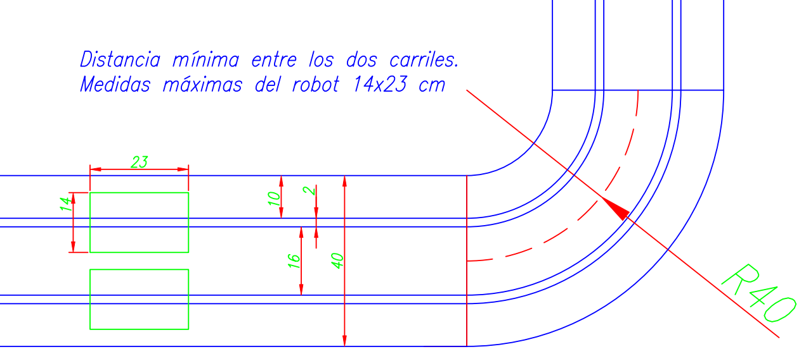

# Reglamento técnico de Carreras – Liga Nacional de Robótica (LNR)

## 1) Introducción
Un robot seguidor de línea es un tipo de robot que utiliza sensores para detectar una línea dibujada en una superficie y seguir su recorrido.
Los sensores utilizados en los robots seguidores de línea pueden ser de diferentes tipos, como sensores de luz o de infrarrojos. El sensor detecta la línea dibujada en la superficie y envía una señal al controlador del robot, que ajusta la velocidad y dirección de los motores
para mantener al robot en la línea.

Los robots seguidores de línea son un ejemplo de la aplicación de la robótica en la automatización de tareas sencillas, como el seguimiento de una línea, lo que puede tener aplicaciones en la industria, por ejemplo, en la automatización de líneas de producción.

Este reglamento define la competencia entre varios de estos seguidores en una modalidad de tipo carrera. Separándolos en diferentes tipos de carreras según el tipo de hardware del seguidor.

Este reglamento **complementa** al **Reglamento General de la LNR** y remite a él en todo lo no previsto de forma expresa.

---

## 2) Categorías
- **Carrera Pro**: se permiten impulsores (p. ej., turbinas/aspas) para aumentar adherencia/empuje, con las restricciones de software y seguridad indicadas en este reglamento.  
- **Carrera**: **no** se permiten impulsores o sistemas de succión/empuje (turbinas, palas, etc.). Solo el **peso propio** y tracción del robot.

---

## 3) Objetivo
Recorrer el circuito siguiendo la línea y **completar “n” vueltas** antes que el rival. Se corre en **dos carriles** paralelos que recorren el mismo trazado. O en el que mas lejos llegue en caso de no completar las vueltas por los participantes.

---

## 4) Características técnicas del robot

### 4.1 Aspectos generales
- El deberá llevar un codigo visible de 1 cm x 2 cm **como el numero de homologación**, deberá disponer de este area para poder identificarlo en la homologación por la organización.  

### 4.2 Hardware
- **Dimensiones máximas:** 20 cm (largo) × 14 cm (ancho) × 10 cm (alto).  
- **Autonomía:** luego de la largada **no** puede operarse; si hay control remoto para encendido/parada, podrá exigirse dejarlo en la mesa del juez tras la largada.  
  - Única orden permitida tras la largada: **parada** de emergencia.  
- **Inicio:** remoto o por **pulsador**.  
- **Indicador de largada:** **LED obligatorio** (fijo o intermitente) que se encienda cuando inicia la rutina de carrera.  
- **Motorización:** motores/motorreductores **eléctricos** o **servos**.  
- **Baterías:** se permiten cambios/recarga fuera de carrera, sin alterar forma/peso de modo significativo.  
- **Identificación técnica:** reservar un área visible mínima de **23 × 14 mm** (no puede ser parte de la batería) para rotulación/etiqueta del evento.  
- **Carrera (no Pro):** **prohibidos** impulsores/palas/succión.  
- **Carrera Pro:** impulsores/aspas **permitidos**, pero deben permanecer **apagados/quietos** hasta el **semáforo verde** (ver §4.3).

> **Sustancias de adherencia** en ruedas/suelo: **prohibidas**. La **prueba de hoja A4** podrá realizarse **en cualquier momento** (ver Reglamento General – Sustancias prohibidas).

### 4.3 Software
- Encender el **LED de largada** al iniciar la rutina de movimiento.  
- **Carrera Pro:** turbina/aspas **apagadas/quietas** hasta la señal de inicio (se verifica en homologación y puede reverificarse en pista).

---

## 5) Área de competencia
- Dos **líneas de 2 cm** (± 0,3 cm) de ancho, sobre fondo contrastante, separadas **≥ 18 cm**.  
- Las líneas conforman un **circuito cerrado**.  
- **Ancho total de pista:** **40 cm** (± 0,5 cm), garantizando **≥ 6 cm** entre robots.  
- Pista **elevada** sobre el nivel del suelo.  
- **Curvas:** radio mínimo **30 cm** (± 10%), sin peralte.  
- La superficie puede tener **irregularidades**; las elevaciones no superan **20°** de pendiente.  
- **Perímetro libre:** **≥ 1 m** alrededor, sin obstáculos.  
- Color del circuito: a criterio del organizador (pista negra con líneas blancas o viceversa).  
- No se permiten **marcas de aviso** de curvas.

---

## 6) Homologación
Para competir, el robot debe aprobar:
- **Dimensiones** reglamentaria.  
- **Foto de inscripción**.  
- **Verificación de encendido** y **LED de largada** (el LED debe encender **junto** con el movimiento de las ruedas).  
- **Carrera Pro:** verificación de que turbina/aspas quedan **inactivas** hasta la señal de partida.

El jurado puede **reverificar** en cualquier momento (peso, medidas, LED, impulsores, sustancias prohibidas, etc.).

---

## 7) Desarrollo de la competencia

### 7.1 Indicaciones previas
- Verificación de identidad del robot adversario (imagen sistema/etiqueta del evento).  
- **Ruedas sin adherentes** (prueba en hoja).  
- **Pruebas libres** Antes de la primera ronda, los equipos podrán hacer pruebas libremente sobre la
pista. El resto de las pruebas deberá ser consensuada con los jueces, **a criterio del jurado**. 
- Podrá convocarse a **todos los competidores** de una llave para agilizar la secuencia.  
- Formato general: **Fase de grupos**, **eliminación directa**, **tercer puesto** y **final** (según defina el sistema).  
- Una **ronda** puede consistir en **2, 3 o 5 carreras** (según instancia/cantidad de inscriptos) y como lo defina la organización del evento.  
- El **tiempo máximo** por carrera/ronda se informará antes del inicio del torneo.

### 7.2 Inicio
- Hasta **3 llamados** con **1 min** entre avisos.  (Reglamento General)
  - Si un equipo no se presenta **1 min** tras el último llamado, gana el oponente que **haya colocado** su robot en la pista.  
  - Si **ninguno** se presenta, el jurado puede esperar hasta **5 min** y, de persistir, **eliminar** a ambos.  
- Entre carreras: **1 min** máximo de espera para reiniciar.

### 7.3 Rutina de carrera
- **Sorteo inicial**: el ganador elige carril; luego se **alterna**.  
- El capitán coloca el robot en la **línea de largada**.  
- Una vez dada la señal dispone de 30 segundos para calibrar/configurar, si es que lo necesita (acorde al "Apoyaron" semaforo de liga).
- Antes/luego de posicionar, se permiten **calibraciones** (switch/controles, sensores).  
- A la orden del juez, se **encienden** los robots (LED de largada visible).  
- Durante la carrera, nadie ingresa al **área de competencia** sin autorización.

---

## 8) Sanciones

### 8.1 Faltas que **reinician** la carrera
- Largar **antes** de la orden del árbitro.  
- Activar **cualquier sistema** antes de la señal de inicio.

Cuando la carrera se haya reiniciado se volverá a empezar inmediatamente desde las posiciones de inicio **sin** poder intervenir sobre robot para realizar algún mantenimiento.

### 8.2 Faltas que **no reinician** la carrera
- Ingresar al área de pista **sin autorización** (incluye miembros no responsables).  
- Solicitud **injustificada** de parar.  
- **Tiempo Adicional** concedido (ver §12).  
- **Desprendimiento** de piezas (si no interfiere al rival ni vulnera seguridad).

### 8.3 Penalizaciones (pérdida de la carrera)
- **Interferencia** al rival por pieza **desprendida**.  
- No cruzar **completamente** la línea de largada **en 10 segundos** tras la orden (si **ninguno** cruza en 10 s → **empate** y se pasa a la siguiente carrera).  
- Permanecer **10 s inmóvil** en cualquier parte del recorrido, salvo que en ese instante sea quien **va adelante**; en tal caso, la cuenta inicia cuando el rival lo **supere**.  
- Ser **alcanzado** en una pista con **cruce**, antes de cumplir las “n” vueltas.  
- **Adherencia prohibida** (pegamentos, etc.).  
- Salirse **completamente** de la pista y que el adversario **supere** el punto de salida.  
- El capitán **no** se presenta por estar compitiendo en otra llave/moda.  
- Maniobras consideradas **caída en el punto** (el rival debe superar ese punto):
  - **Vuelta en U**.  
  - **Vuelta 360°** o más.  
  - **Cambio de carril**.

---

## 9) Puntuación de cada carrera
- Gana la carrera el robot que **complete primero** las **“n” vueltas** alcance al otro por pista con cruce o llegue más lejos.  
- También se puede ganar por **acumulación de faltas** del rival (según aplique).  
- Si **ninguno** completa las “n” vueltas tras iniciada la carrera, gana quien haya recorrido **mayor distancia**; si hay **misma** distancia → **reinicio**.  
- Si durante el desarrollo el oponente **toca el piso** (y va por detrás), se considera **victoria** del otro.  
- Si expira el **tiempo máximo**, gana quien tenga **mayor distancia recorrida**.

---

## 10) Parada de la carrera
- Se detiene cuando se cumplen faltas que la **detienen** (seguridad/juez).  
- Al parar, se **reinicia inmediatamente** desde posiciones de inicio, **sin** intervención de mantenimiento.

---

## 11) Definición de la ronda y fin
- Gana la **ronda** el robot que alcance **2 o 3 puntos** (según instancia).  
- Si tras **3 o 5 carreras** nadie alcanza el umbral, gana quien tenga **más puntos**; si empatan, la ronda se declara **empate** según formato del torneo o lo que dictamine el sistema de gestión.

---

## 12) Tiempo adicional
- **Una sola vez** en todo el torneo, el equipo puede pedir **5 min** de **tiempo adicional** por daño/mal funcionamiento.  (Reglamento General)
- El conteo inicia cuando el participante llega a su **box**; el oponente deja su robot **en pista** y **no** puede intervenirlo.  
- Si no se resuelve a tiempo, la ronda/carrera se da por **finalizada** a favor del rival (**2 o 5–0**, según instancia).  
- La concesión queda a **criterio del juez** y se asigna **una falta** al solicitante (no reinicia la carrera por sí misma).

---

## 13) Glosario
- **Recorrido:** tramo de pista.  
- **Carrera:** enfrentamiento entre dos participantes para cumplir el objetivo (una o más vueltas).  
- **Ronda:** serie de carreras hasta definir un ganador del emparejamiento.  
- **Competencia:** fecha/evento donde se disputan las rondas.

---

## 14) Referencias al Reglamento General
Para evitar duplicidad, se remite al [**Reglamento General de la LNR**](https://sistema.lnr-argentina.com.ar/reglamentos/General) en:
- Normas de convivencia y **responsabilidad de equipo**.  
- Autoridad de la **Organización** y **jueces**; funciones del jurado; **reverificación**.  
- Sustancias prohibidas y **prueba de hoja A4** en cualquier momento.  
- **Llamados**, presentación válida y tiempos operativos generales.  
- Procedimiento de **reclamos**.  
- **Primacía del sistema** de gestión ante casos no previstos.
