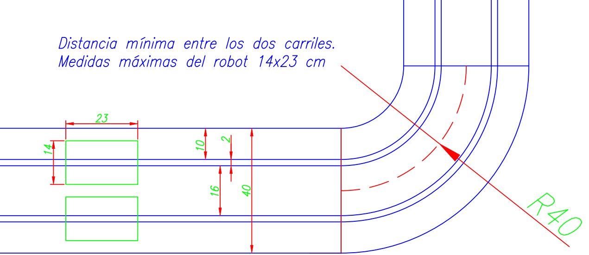

# Reglamento técnico de Carreras – Liga Nacional de Robótica (LNR)

## 1) Introducción
Un robot seguidor de línea es un tipo de robot que utiliza sensores para detectar una línea dibujada en una superficie y seguir su recorrido.
Los sensores utilizados en los robots seguidores de línea pueden ser de diferentes tipos, como sensores de luz o de infrarrojos. El sensor detecta la línea dibujada en la superficie y envía una señal al controlador del robot, que ajusta la velocidad y dirección de los motores
para mantener al robot en la línea.

Los robots seguidores de línea son un ejemplo de la aplicación de la robótica en la automatización de tareas sencillas, como el seguimiento de una línea, lo que puede tener aplicaciones en la industria, por ejemplo, en la automatización de líneas de producción.

Este reglamento define la competencia entre varios de estos seguidores en una modalidad de tipo carrera. Separándolos en diferentes tipos de carreras según el tipo de hardware del seguidor.

Este reglamento **complementa** al **Reglamento General de la LNR** y remite a él en todo lo no previsto de forma expresa.

---

## 2) Categorías
- **Carrera Pro**: se permiten impulsores (p. ej., turbinas/aspas) para aumentar adherencia/empuje, con las restricciones de software y seguridad indicadas en este reglamento.  
- **Carrera**: **no** se permiten impulsores o sistemas de succión/empuje (turbinas/impulsores/palas/succión etc.). Solo el **peso propio** y tracción del robot.

---

## 3) Objetivo
Recorrer el circuito siguiendo la línea y **completar “n” vueltas** antes que el rival, o llegar más lejos en caso que ninguno complete las vueltas. Se corre en **dos carriles** paralelos que recorren el mismo trazado. 

---

## 4) Características técnicas del robot

### 4.1 Aspectos generales
- El robot deberá llevar un código visible de 1 cm x 2 cm **como el numero de homologación**, deberá disponer de este area para poder identificarlo en la homologación por la organización (no puede ser parte de la batería).

### 4.2 Hardware
- **Dimensiones máximas:** 20 cm (largo) × 14 cm (ancho) × 10 cm (alto).  
- **Autonomía:** luego de la largada **no** puede operarse; si hay control remoto para encendido/parada, podrá exigirse dejarlo en la mesa del juez o en el suelo tras la largada.  
  - Única orden permitida tras la largada: **parada** de emergencia.  
- **Inicio:** remoto o por **pulsador**.  
- **Indicador de largada:** **LED obligatorio** (fijo o intermitente) que se encienda cuando inicia la rutina de carrera.  
- **Motorización:** motores/motorreductores **eléctricos** o **servos**.  
- **Baterías:** se permiten cambios/recarga fuera de carrera, sin alterar forma/peso de modo significativo.  
- **Carrera Pro:** impulsores/aspas **permitidos**, pero deben permanecer **apagados/quietos** hasta el **semáforo verde** (ver §4.3).

> **Sustancias de adherencia** en ruedas/suelo: **prohibidas**. La **prueba de hoja A4** podrá realizarse **en cualquier momento** (ver Reglamento General – Sustancias prohibidas).

### 4.3 Software
- Encender el **LED de largada** al iniciar la rutina de movimiento.  
- **Carrera Pro:** turbina/aspas **apagadas/quietas** hasta la señal de inicio (se verifica en homologación y puede reverificarse en pista).

---

## 5) Área de competencia
- Dos **líneas de 2 cm** (± 0,3 cm) de ancho, sobre fondo contrastante, separadas **≥ 18 cm**.  
- Las líneas conforman un **circuito cerrado**.  
- **Ancho total de pista:** **40 cm** (± 0,5 cm), garantizando **≥ 6 cm** entre robots.  
- Pista **elevada** sobre el nivel del suelo.  
- **Curvas:** radio mínimo **20 cm** (± 10%), sin peralte.  
- La superficie puede tener **irregularidades**; las elevaciones no superan **20°** de pendiente.  
- **Perímetro libre:** **≥ 1 m** alrededor, sin obstáculos.  
- Color del circuito: a criterio del organizador (pista negra con líneas blancas o viceversa).  
- Se permiten **líneas de aviso** opcionales (no obligatorias), sujetas a las siguientes condiciones:
  - Las líneas del **lado derecho** del carril indican el **inicio y fin de la pista**.
  - Las líneas del **lado izquierdo** del carril indican el **cambio de curvatura**, ubicadas **10 cm antes** de donde comienza dicho cambio.
  - Las líneas deben ser **perpendiculares a la línea central** y estar separadas de ella por un espacio de **2,5 cm** (no pueden tocarla).
  - **No** pueden colocarse líneas de aviso a **ambos lados** del carril al mismo tiempo.
  - Pueden realizarse con **cinta aislante**: blanca sobre fondo negro, o negra sobre fondo blanco.

---

## 6) Homologación
Para competir, el robot debe aprobar:
- **Dimensiones** reglamentaria.  
- **Foto de inscripción**.  
- **Verificación de encendido** y **LED de largada** (el LED debe encender **junto** con el movimiento de las ruedas).  
- **Carrera Pro:** verificación de que turbina/aspas quedan **inactivas** hasta la señal de partida.

El jurado puede **reverificar** en cualquier momento (peso, medidas, LED, impulsores, sustancias prohibidas, etc.).

---

## 7) Desarrollo de la competencia

### 7.1 Indicaciones previas
- Verificación de identidad del robot adversario (imagen sistema/etiqueta del evento).  
- **Pruebas libres** Antes del primer encuentro del evento, los equipos podrán hacer pruebas libremente sobre la
pista. El resto de las pruebas deberá ser consensuada con los jueces, **a criterio del jurado**. 
- Podrá convocarse a **todos los competidores** de una llave/grupo para agilizar la secuencia.  
- Formato general: **Fase de grupos**, **eliminación directa**, **tercer puesto** y **final** (según defina el sistema).  
- Un **encuentro** puede consistir en **2, 3 o 5 carreras** (según instancia/cantidad de inscriptos) y como lo defina la organización del evento.  
- El **tiempo máximo** por carrera y la cantidad de vueltas por carrera se definirá antes del inicio del torneo y en las instancias finales se podrá acordar entre los participantes, la cantidad de carreras para definir el avance de instancia.  

### 7.2 Inicio
- Hasta **3 llamados** con **1 min** entre avisos.  (Reglamento General)
  - Si un equipo no se presenta **1 min** tras el último llamado, gana el oponente que **haya colocado** su robot en la pista.  
  - Si **ninguno** se presenta, el jurado puede esperar hasta **5 min** desde el ultimo llamado y, de persistir, **eliminar** a ambos.  
- Entre carreras: **1 min** máximo de espera para reiniciar.

### 7.3 Rutina de carrera
- **Sorteo inicial**: el ganador elige carril; luego se **alterna**.  
- El capitán coloca el robot en la **línea de largada**.  
- Una vez dada la señal dispone de 30 segundos para calibrar/configurar, si es que lo necesita (acorde al "Apoyaron" semaforo de liga). 
- Antes/luego de posicionar, se permiten **calibraciones** (switch/controles, sensores).  
- A la orden del juez, se **encienden** los robots (LED de largada visible).  
- Durante la carrera, nadie ingresa al **área de competencia** sin autorización, salvo para **retirar su propio robot ante peligro inminente de colisión**; en ese caso debe avisar al juez inmediatamente.

### 7.4 Uso de dispositivos electrónicos
Durante la competencia oficial en los encuentros, se prohíbe el uso de
computadoras, notebooks, tablets u otros dispositivos que permitan reprogramación
extensa o análisis avanzado del robot. 

Solo se permitirá el uso de **teléfonos celulares** o **controles remotos** exclusivamente para:
- Cargar configuraciones previamente desarrolladas.
- Ajustar parámetros rápidos.
- Controlar aplicaciones necesarias para iniciar el robot o seleccionar perfiles.

Los ajustes, cargas o cambios solo pueden realizarse durante el tiempo permitido
entre carreras (1 minuto reglamentario) y sin asistencia de terceros externos.

Queda totalmente prohibido:
- Programar o reprogramar código durante un encuentro, a excepción de hacerlo en el tiempo adicional.
- Conectarse remotamente con una PC o dispositivo externo.

Durante **horarios de práctica y calibración autorizados**, quedará libre el uso de
computadoras, notebooks y tablets.

---

## 8) Sanciones

Todas las infracciones se clasifican en dos tipos: **Faltas** y **Pérdida directa de carrera**.

### 8.1 FALTAS (la carrera continúa o se reinicia)
Se considera Falta cuando la acción infringe el reglamento pero no genera contacto, interferencia,
ni daño sobre el rival. Ejemplos:

- Maniobras prohibidas sin contacto (vuelta en U, 360°, cambio de carril sin colisión).  
- Desprendimiento de piezas.  
- Ingreso al área de pista sin consecuencias deportivas.  
- Activar cualquier sistema antes de la señal de inicio. Ej. Turbinas sea el caso.  
- Las faltas son por carrera.
- **Tiempo Adicional** concedido (ver §12).  

Acumulación:
- **Dos (2) faltas equivalen a pérdida de carrera por 1–0.**

### 8.2 PÉRDIDA DE LA CARRERA
- Ser **alcanzado** en una pista con **cruce**, antes de cumplir las “n” vueltas. No penaliza como Colision del punto 8.3. 
- Salirse **completamente** de la pista y que el adversario **supere** el punto de salida.  - **Largada prematura o activación antes de la orden** (el robot que largó antes pierde esa carrera).  

### 8.3 PÉRDIDA DEL ENCUENTRO (PENALIZACIÓN)
El piloto pierde automáticamente la totalidad del encuentro cuando en la carrera se genera acción de contacto, interferencia,
afectación o riesgo sobre el rival o su recorrido. Ejemplos:

- Maniobra prohibida con colisión.
- Desprendimiento de pieza que hace contacto con el rival.
- Colisión, bloqueo, empuje o cualquier contacto.
- Ingreso al área de pista con consecuencias deportivas.  
- El capitán **no** se presenta por estar compitiendo en otra categoria.  

Penalización: Implica resultado de **2–0.**

| Situación                      | Consecuencia                   | Resultado        |
| ------------------------------ | ------------------------------ | ---------------- |
| Falta sin riesgo ni contacto   | Suma 1 Falta                   | Continúa         |
| 2 Faltas acumuladas            | Pérdida de carrera             | 1–0              |
| Contacto, riesgo o bloqueo     | Pérdida de encuentro           | 2–0              |

---

## 9) Puntuación de cada carrera
- Gana la carrera el robot que **complete primero** las **“n” vueltas**, alcance al otro por pista con cruce o llegue más lejos.  
- También se puede ganar por **acumulación de faltas** del rival (según aplique). Dos faltas equivalen a una carrera perdida.  
- Si **ninguno** completa las “n” vueltas tras iniciada la carrera, gana quien haya recorrido **mayor distancia**; si hay **misma** distancia → **reinicio**.  
- Si durante el desarrollo un robot **toca el piso** (y va por detrás), se considera **victoria** del otro oponente.  
- Si expira el **tiempo máximo**, gana quien tenga **mayor distancia recorrida**.

---

## 10) Parada de la carrera
- Se detiene cuando se cumplen faltas que la **detienen** (seguridad/juez).  
- Al parar, se **reinicia inmediatamente** desde posiciones de inicio, **sin** intervención de limpieza de ruedas o reconfiguración.  

---

## 11) Definición de encuentro y fin
- Gana el **encuentro** el robot que alcance **2 o 3 puntos** (según instancia).  
- Si tras **3 o 5 carreras** nadie alcanza el umbral, gana quien tenga **más puntos**; si empatan, la ronda se declara **empate** según formato del torneo o lo que dictamine el sistema de gestión.

---

## 12) Tiempo adicional
- **Una sola vez** en todo el torneo, el equipo puede pedir **5 min** de **tiempo adicional** por daño/mal funcionamiento.  (Reglamento General). Solo se puede pedir en el minuto de tiempo que hay entre carreras.
- El conteo inicia cuando el participante llega a su box; el oponente deja su robot en pista y no puede intervenirlo.  
- Si no se resuelve a tiempo, el encuentro/carrera se da por **finalizada** a favor del rival (**2 o 5–0**, según instancia).  
- La concesión queda a **criterio del juez** y se asigna **una falta** al solicitante (no reinicia la carrera por sí misma).

---

## 13) Glosario
- **Recorrido:** tramo de pista.  
- **Carrera:** recorrido entre dos robots para cumplir el objetivo (una o más vueltas).  
- **Encuentro:** serie de carreras a definir entre dos robots.  
- **Competencia:** fecha/evento donde se disputan los encuentros.

---

## 14) Referencias al Reglamento General
Para evitar duplicidad, se remite al [**Reglamento General de la LNR**](https://sistema.lnr-argentina.com.ar/reglamentos/General) en:
- Normas de convivencia y **responsabilidad de equipo**.  
- Autoridad de la **Organización** y **jueces**; funciones del jurado; **reverificación**.  
- Sustancias prohibidas y **prueba de hoja A4** en cualquier momento.  
- **Llamados**, presentación válida y tiempos operativos generales.  
- Procedimiento de **reclamos**.  
- **Primacía del sistema** de gestión ante casos no previstos.
