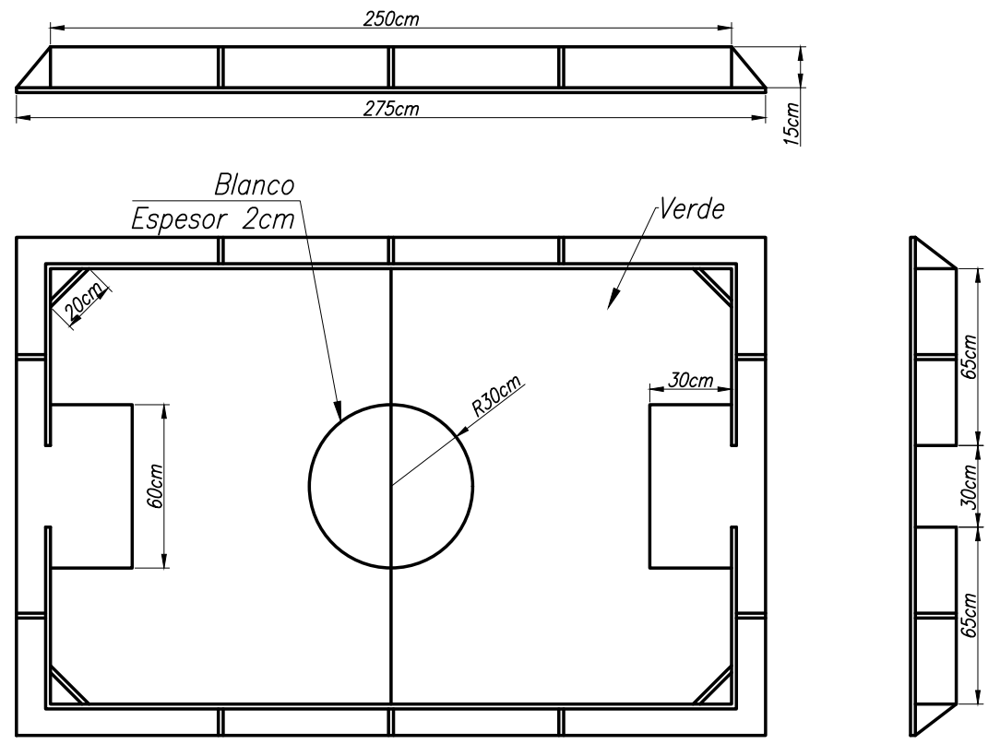

# Reglamento técnico de Fútbol – Liga Nacional de Robótica (LNR)

## 1) Introducción
La modalidad **Fútbol** enfrenta dos equipos que intentan anotar más goles que su rival, utilizando robots radiocontrolados en una cancha delimitada.
Cada equipo podrá jugar con un máximo de 2 robots.
También está permitido contar con un robot suplente. El robot suplente debe inscribirse en la ficha del equipo y no puede pertenecer a otro equipo.

Este reglamento **complementa** al **Reglamento General de la LNR** y remite a él en todo lo no previsto de forma expresa.

---

## 2) Objetivo y conformación de equipos
- Gana el equipo que **convierta más goles**.
- Cada equipo juega con **2 robots en cancha** (mínimo 1).  
- Puede inscribirse **1 robot suplente** (debe figurar en la ficha del equipo y no pertenecer a otro equipo).

---

## 3) Características técnicas del robot

### 3.1 Aspectos generales
- Identificación visible del **nombre** del equipo/institución y **número** de robot (hasta dos cifras).  
- Prohibidas inscripciones ofensivas o inadecuadas.  (Reglamento General)

### 3.2 Especificaciones
- **Dimensiones máximas:** 20 × 15 cm (en cualquier orientación). **Sin límite de altura**.  
- **Peso máximo:** 1 kg.  
- **Tracción:** motores/motorreductores **eléctricos**.  
- **Baterías:** Se permitirá el cambio de las baterías durante la competencia siempre y cuando no
alteren la forma y peso del robot de manera significativa.
- **Control:** **radiocontrolado** (cualquier tecnología/modulación); la organización **no garantiza** canales/frecuencias libres y puede **limitar tecnologías** si fuera necesario.  
- **Indicador de activación:** el robot debe poseer **LED** que indique encendido.  
- **Prohibido** desplegar piezas, separarse en partes o **sujetar la pelota**.  
  - Se permiten aberturas para alojar la pelota **siempre que**:  
    - la distancia entre bordes sea > **2 diámetros** de la pelota, y  
    - la pelota quede **liberada al menos por 1 radio**.  
- **Dispositivos activos de pateo/lanzamiento**: permitidos si actúan **horizontalmente** y quedan **totalmente contenidos** dentro del volumen del robot (sin interferir con la cancha).  
- **Sustancias de adherencia**: **prohibidas** (ver “Sustancias Prohibidas” del Reglamento General). La **prueba de hoja A4** podrá realizarse **en cualquier momento**.

> **Nota:** lo relativo a **conducta**, **autoridad de jueces**, **reverificación** (peso/medidas/seguridad) y **reclamos** rige según el **Reglamento General**.

### 3.3 La pelota
- Diámetro **5–6 cm**, material de **goma espuma blanda**.

---

## 4) Cancha y zona de competencia
- **Dimensiones de juego:** mínimo **2,50 m × 1,60 m** (máximo +15%).  
- **Arcos:** **30 cm** de ancho × **15 cm** de alto, con travesaño a **15 cm**.  
- **Esquineros:** 20 cm de largo.  
- **Área de arco:** 60 × 30 cm delimitada pintada.  
- **Marcaciones:** línea media y círculo central.  
- **Perímetro:** pared de **15 cm** de altura.  
- **Demarcación central:** El centro del campo de juego estará marcado con una línea al igual que el circulo central.
- **Buffer de seguridad:** franja perimetral de **1 m** fuera de la pared, reservada a jugadores y árbitro.

---

## 5) Homologación
Para competir, cada robot debe aprobar:
- **Medidas** y **peso** reglamentarios.  
- **Foto de inscripción siempre van dos robots, o incluir el suplente también** un solo robot presentado sera rechazado automaticamente por sistema.   
- **Verificación** del sistema de control **remoto**.

El jurado puede **reverificar** en cualquier momento del evento.

---

## 6) Desarrollo del partido

### 6.1 Formato y tiempos
- **Dos tiempos** de **3 minutos** cada uno; **entretiempo** de **1 minuto**.  
  - La organización puede ajustar estos tiempos y lo comunicará **antes de iniciar** la competencia.
- **Sorteo inicial**: se lanzará una moneda, y el ganador elige **campo** o **saque inicial**.  
- En el **segundo tiempo** se **cambian campos**; el saque es del equipo que no sacó al inicio.
- **Gol válido** cuando la pelota **ingresa totalmente** al arco (si rebota y sale, el gol **vale**).

### 6.2 Rutina de juego
- **Saque inicial**: el árbitro coloca la pelota en el **centro**; el equipo que saca inicia moviendo la pelota. El rival permanece **dentro de su área** hasta el primer toque.  
- Los robots pueden moverse por toda la cancha, pero queda prohibido permanecer dentro de su propia área sin disputa de la pelota.  
- **Marcar y bloquear** está permitido; **empujar a un compañero** para sumar fuerza está **prohibido**.  
- Ante **gol** o **salida de pelota**, el juego se **reinicia en el centro**; saca el equipo que **recibió el gol** o **no** fue quien la envió afuera.  
- Robots **detenidos/averiados** pueden retirarse y reingresar **con autorización del juez**, por un lateral en la mitad contraria en la que se encuentre la pelota al momento del ingreso.
- Si un robot detenido no demuestra movimiento y el juez interpreta que **interrumpe el juego**, podrá ordenar su **retiro de la cancha**.  
- Podrá tener el suplente disponible para poder hacer sustituciones. En caso de contar con un suplente deberá avisar con anticipación al referí para tener en cuenta, ya que una vez que inicia el juego solo pueden estar alrededor de la cancha los participantes.  
- **Adherencia prohibida** en ruedas: pérdida del juego **2–0** si se detecta uso de pegamentos/aditivos (además de lo previsto por el Reglamento General).  

### 6.3 Sustituciones
- Los robots pueden ser sustituidos **por cualquier motivo** (daño, simple sustitución por otro participante, etc.).  
- Permitidas en **cualquier momento**, preferentemente en **interrupciones** (gol, salida o detención del juego).  
- Requieren **autorización** del juez.  
- Cambios **ilimitados**.  
- Nunca puede haber **más de 2 robots** por equipo en cancha.

### 6.4 Empates – Tiempo adicional y penales
- **Eliminación directa**: si hay empate, se define por **penales**.  
- **Final**: primero se juegan **2 minutos extra**; si persiste el empate, **penales**.  
- La **cantidad** y **modo de ejecución** de penales serán definidos e informados por el juez.

### 6.5 Ejecución de penales
- El ejecutante se ubica **dentro de su área**; la pelota en el **centro**.  
- El compañero del ejecutante puede ubicarse en **cualquier punto de su mitad**.  
- Los rivales se sitúan en **cada córner** de su campo.  
- A la orden del juez, el ejecutante dispone de **10 s** para dar **un solo toque**: la pelota debe **rodar** y cruzar la línea de gol **sin tocar paredes** (excepto las del arco).  
- Los rivales **no** pueden mover sus robots hasta que la pelota **toque una pared**.

---

## 7) Sanciones

### 7.1 Faltas (reanudación con posesión)
- **a.1)** No detener el robot ante **interrupción** del juez.  
- **a.2)** **Desprendimiento** de alguna pieza del robot.  
- **a.3)** Realizar un **cambio** sin autorización del juez.  
- **a.4)** **Retener** la pelota contra la pared sin intención de juego.  
- **a.5)** **Interrumpir** el recorrido de un robot hacia el gol, sin disputar la pelota.  
- **a.6)** **Empujar** a un compañero para aumentar fuerza de empuje.  

**Aplicación:**  
- Advertencia verbal.  
- **Posesión de la pelota** para el equipo que sufrió la falta.  
- Ejecución desde el punto indicado por el juez.  
- El rival debe mantener distancia > **dos robots**.  
- El equipo que cobra la falta podrá ejecutar directamente al arco; el gol será válido si se concreta.

---

### 7.2 Tarjeta amarilla (penal para el equipo contrario)
Se aplicará tarjeta amarilla y penal en contra por:  

- **b.1)** Dañar deliberadamente a un robot rival, sin disputar la pelota.  
- **b.2)** Cualquier conducta que el juez considere antideportiva.  
- **b.3)** Reiteración de faltas previamente advertidas.  

---

### 7.3 Tarjeta roja (expulsión del robot)
Un robot recibirá tarjeta roja en los siguientes casos:  

- **c.1)** Acumulación de dos tarjetas amarillas.  
- **c.2)** Conducta antideportiva grave.  
- **c.3)** Insultar a un oponente o al juez.  

**Efecto:**  
- El robot es **expulsado del partido** y no puede ser reemplazado.  
- Si un equipo queda **sin robots en cancha** por acumulación de rojas, el partido finaliza inmediatamente y gana el rival, sin importar el marcador parcial.  

---

### 7.4 Facultades extraordinarias del jurado
En casos extremos, los jueces o el jurado podrán **expulsar de la competición** a jugadores, equipos o delegaciones por conductas graves, incluso de manera directa, sin necesidad de acumulación de faltas o tarjetas.

---

## 8) Parada y suspensión del partido
- El **juez** es el único autorizado para **detener** o **suspender** el partido.  
- Motivos: cánticos **discriminatorios**, **insultos** del público/jugadores, **riesgo** o condiciones inadecuadas, u otras razones de seguridad/equidad.  
- El juez definirá las **sanciones** a aplicar a uno o ambos equipos según el caso.

---

## 9) Tiempo adicional
El tiempo adicional será considerado por el Juez del partido, teniendo en cuenta el tiempo
que por algún motivo el partido estuvo detenido

---

## 10) Fin del partido
- Termina al finalizar el **segundo tiempo** (más el **adicional** que determine el juez).  
- En definiciones por **penales**, finaliza al ejecutar el **último penal**.

### 10.1 Finalización del partido ante rotura de robots

10.1.1 Equipo en ventaja con rivales sin robots operativos
Si un equipo va ganando y el equipo contrario queda sin robots operativos, aun agotando su tiempo reglamentario de reparación, el partido se dará por finalizado. El resultado será el marcador existente al momento en que el árbitro declare que el equipo rival no puede continuar.

10.1.2 Equipo en desventaja pero con robots operativos
Si ocurre lo inverso —el equipo que va perdiendo mantiene robots funcionales y el equipo que va ganando queda sin robots aptos para continuar—, se ajustará el marcador sumando tantos goles como sean necesarios para que el equipo con robots en funcionamiento pase a ganar con la mínima diferencia.

10.1.3 Determinación oficial
La verificación de que un equipo no puede continuar es responsabilidad del árbitro principal. Esta decisión debe ser comunicada inmediatamente a ambos equipos y registrada por la mesa de jueces en el acta del partido.

---

## 11) Referencias al Reglamento General
Para evitar duplicidad, se remite al [**Reglamento General de la LNR**](https://sistema.lnr-argentina.com.ar/reglamentos/General) en:
- Esta categoria no adhiere al punto 12 del Reglamento General, sobre tomar 5 minutos en talleres, el tiempo es de 1 minuto, en el propio lugar de competencia y por única vez.   
- Normas de convivencia y **responsabilidad de equipo**.  
- Autoridad de la **Organización** y **jueces**; funciones del jurado; **reverificación**.  
- Sustancias prohibidas y **prueba de hoja A4** en cualquier momento.  
- **Llamados**, presentación válida y tiempos operativos generales.  
- Procedimiento de **reclamos**.  
- **Primacía del sistema** de gestión ante casos no previstos.
