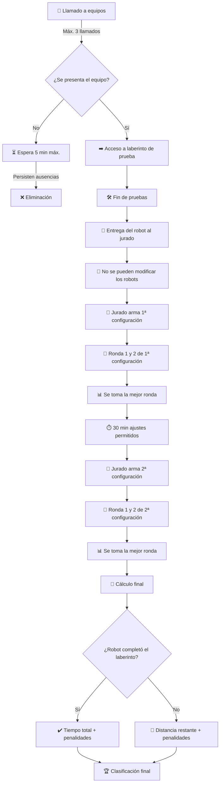

# Reglamento técnico de Laberinto – Liga Nacional de Robótica (LNR)

## 1) Introducción
La disciplina de **Laberinto** consiste en que un robot autónomo encuentre la salida en el menor tiempo posible dentro de un área delimitada, según las reglas aquí detalladas.

Este reglamento complementa al **Reglamento General de la LNR**, al cual remite en todos los casos no previstos expresamente.

---

## 2) Objetivo
El objetivo de la modalidad “Laberinto” es encontrar la salida en el menor tiempo posible.

---

## 3) Características técnicas del robot
3.1 El robot podrá llevar visible el nombre del equipo o institución.  
3.2 Quedan prohibidas inscripciones ofensivas o inadecuadas.  
3.3 La organización podrá fotografiar y filmar los robots durante el evento.  
3.4 No existen dimensiones máximas, pero deben ser compatibles con el tamaño del laberinto (giros en celdas de 25 cm).  
3.5 El robot no puede tener elementos que dañen el circuito.  
3.6 Debe contar con un **interruptor visible y accesible** para detenerlo inmediatamente. El interruptor debe ser visible y accesible quedando a criterio de los jueces el cumplimiento de este requerimiento.  
3.7 Deben ser **completamente autónomos** (sin conexión o control externo). Está permitido transmitir datos telemétricos, pero el robot debe funcionar sin ese enlace si lo solicita el jurado.  
3.8 Prohibido operar sobre el robot una vez comenzada la prueba.  
3.9 Motorización: solo **motores eléctricos de corriente continua** alimentados por baterías.  
3.10 No se tendrán restricciones en cuanto a los elementos constructivos, por lo tanto, pueden ser utilizados componentes comerciales de cualquier tipo, incluyendo los pertenecientes a Kits.  
3.11 Se permite cambio y recarga de baterías fuera de la competencia.  

Los robots que no cumplan con estas condiciones podrán ser descalificados de la competencia.

---

## 4) Área de competencia
- El área se compone de celdas de **25 × 25 cm (± 0,5 cm)** medidos de pared interior a pared interior, con una tolerancia de ±0,5 cm.  
- Piso: madera pintada de negro mate.  
- Paredes: blancas, **15 cm (± 0,5 cm)** de altura.  
- El punto de partida será una celda determinada por el jurado al inicio de la competencia.
- La salida será una única celda, marcada con piso de color blanco.
- Las paredes son móviles para generar distintas configuraciones.  
- Dimensión mínima del área: **4 × 5 celdas**.  
- En cada configuración el recorrido debe tener una única salida válida y un único camino resolutivo sin bifurcaciones equivalentes.

Definición de celda: Una celda es una unidad cuadrada delimitada por cuatro paredes perimetrales de 15 cm (±0,5 cm) de altura, salvo en las celdas de inicio y salida donde podrá faltar una pared para permitir entrada o salida.

---

## 5) Desarrollo de la competencia

### 5.1 Definición y puntuación de la competencia

5.1.1 Cada robot deberá completar **dos configuraciones del laberinto**, ambas **determinadas por el Jurado**. Para cada configuración, el Jurado fijará un **tiempo máximo**.

5.1.2 En **cada configuración** habrá **dos rondas por robot**. En cada ronda se registrarán **tiempo**, **penalidades** y **distancia restante hasta la salida (si no completa el recorrido). Para la configuración, se tomará **la mejor ronda** del robot.

5.1.3 Secuencia: una vez que **todos los robots** participantes hayan completado la **primera configuración**, el Jurado **determinará la segunda**; se realizarán nuevamente **dos rondas** por robot y se tomará **la mejor** para esa configuración.

5.1.4 Si el robot **no resuelve** el laberinto dentro del **tiempo máximo** (en cualquiera de las configuraciones), el Jurado determinará:
- **Su posición** al finalizar el tiempo.
- **La distancia restante** hasta la salida, medida como **número de celdas** por el **camino más corto** posible.

5.1.5 Al finalizar la **segunda ronda de la segunda configuración**, se dará por **terminada la prueba**. Para la clasificación se combinarán las **mejores rondas** de cada configuración, obteniendo:
- un **tiempo promedio** (entre ambas mejores rondas),
- una **cantidad de penalidades** (si las hubiera),
- y un **recorrido restante** (si lo hubiera).

**Criterios de clasificación (en este orden):**
1) **Menor tiempo de resolución** del laberinto (**sin penalidades**).  
2) **Menor recorrido restante** hasta la salida (**sin penalidades**).  
3) **Menor tiempo de resolución** con **menor cantidad de penalidades**.  
4) **Menor recorrido restante** con **menor cantidad de penalidades**.
 

### 5.2 Rutina

5.2.1 Para el comienzo del evento se llamará a los equipos participantes hasta un máximo de **3 veces**.  
- Si no comparecen en el minuto siguiente al último llamado, el Jurado podrá eliminar al/los equipo/s o esperar como máximo **5 minutos adicionales**.  
- Una vez cumplido ese tiempo, se procederá a la eliminación. *(Ver también Reglamento General)*

5.2.2 Antes de la primera configuración, los equipos podrán utilizar libremente un **laberinto de prueba** distinto al de competencia.  

5.2.3 Finalizado el tiempo de prueba, cada participante entregará el robot al Jurado y esperará su turno, **sin poder realizar modificaciones** sobre el robot. 

Una vez entregado al jurado, el robot permanecerá bajo supervisión en la mesa de control o en un área designada. Los equipos no podrán retirarlo ni manipularlo salvo en los intervalos autorizados (ej.: entre configuraciones).

5.2.4 El Jurado armará la configuración de laberinto a resolver, determinará el orden de participación e iniciará la **primera ronda**.  

5.2.5 Cada configuración contempla **dos rondas por robot**. El mejor resultado se tomará en cuenta para la puntuación.  

5.2.6 Una vez finalizadas las rondas de la primera configuración, los equipos dispondrán de un **mínimo de 30 minutos** para trabajar sobre el robot antes de iniciar la segunda configuración.  

5.2.7 El representante situará el robot en la posición y orientación indicada por el Jurado y esperará la orden de inicio.  

5.2.8 Mientras se realiza la prueba, **no se podrá retirar el robot** hasta que todos los participantes terminen la segunda ronda.  

5.2.9 Se tomará el **tiempo oficial** cuando el robot alcance la salida. 

El tiempo oficial se detendrá cuando el robot ingrese completamente en la celda de salida (piso blanco), sin ser necesario detener su movimiento dentro de ella.

5.2.10 El representante puede solicitar reiniciar el recorrido. En este caso:  
- El robot volverá al punto de inicio.  
- Se aplicará una **penalización**.  
- El tiempo acumulado hasta el reinicio se mantiene.  

5.2.11 Cada robot contará con un **tiempo máximo de recorrido** fijado por el Jurado.  
- Si no logra completarlo, se calculará la **distancia restante hasta la salida**, medida en celdas por el camino más corto posible.

---

## 6) Parada de la prueba
La prueba se detendrá cuando:
- Lo decida el jurado.  
- Se desprenda una pieza del robot o del laberinto.  
- Se ingrese sin autorización al área de competencia.  
- Se supere el tiempo máximo asignado.  
- El representante solicite reinicio.  
- El robot permanezca **15 segundos inmóvil** o **15 segundos empujando una pared**.  
- El representante solicite **tiempo extra** (una única vez, 5 minutos, sin modificaciones ni cambios de componentes). (Reglamento General)

---

## 7) Penalidades
Se aplicará **penalización y reinicio** cuando:
- El robot permanezca 15 segundos inmóvil.  
- El robot permanezca 15 segundos empujando una pared.  
- El representante solicite reinicio o tiempo extra.  

Tras una penalización, el equipo tendrá **1 minuto** para reiniciar desde el inicio.

---

## 8) Pérdida de la ronda
Un robot pierde la ronda cuando:
- Se le desprende una pieza durante la misma.  
- Si el robot retorna a la celda de inicio, no se considerará salida válida y se tomará como recorrido incompleto.
- El equipo ingrese sin autorización al área.  
- Alcance **3 penalizaciones** en la ronda.  
- No se presente al ser llamado.  
- Provoque deliberadamente un desperfecto en el laberinto.  

En cualquiera de estos casos, se considerará equivalente a **100 penalizaciones**.

---

## 9) Referencias al Reglamento General
Para evitar duplicidad, se remite al [**Reglamento General de la LNR**](https://sistema.lnr-argentina.com.ar/reglamentos/General) en:
- Normas de convivencia y **responsabilidad de equipo**.  
- Autoridad de la **Organización** y **jueces**; funciones del jurado; **reverificación**.  
- Sustancias prohibidas y **prueba de hoja A4** en cualquier momento.  
- **Llamados**, presentación válida y tiempos operativos generales.  
- Procedimiento de **reclamos**.  
- **Primacía del sistema** de gestión ante casos no previstos.

## Diagrama de transcurso del evento Laberinto

