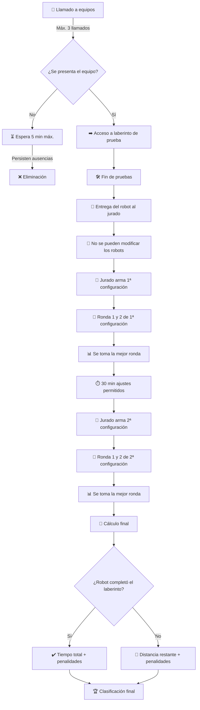

# Reglamento técnico de Laberinto – Liga Nacional de Robótica (LNR)

## 1) Introducción
La disciplina de **Laberinto** consiste en que un robot autónomo encuentre la llegada en el menor tiempo posible dentro de un área delimitada, según las reglas aquí detalladas.

Este reglamento complementa al **Reglamento General de la LNR**, al cual remite en todos los casos no previstos expresamente.

---

## 2) Objetivo
El objetivo de la modalidad “Laberinto” es encontrar la llegada en el menor tiempo posible.

---

## 3) Características técnicas del robot
3.1 El robot podrá llevar visible el nombre del equipo o institución.  
3.2 No existen dimensiones máximas, pero deben ser compatibles con el tamaño del laberinto (giros en celdas de 18 cm).  
3.3 El robot no puede tener elementos que dañen el circuito.  
3.4 Debe contar con un interruptor o pulsador visible y accesible para iniciar y detener el robot.  
3.5 Deben ser **completamente autónomos** (sin conexión o control externo). Está permitido transmitir datos telemétricos, pero el robot debe funcionar sin ese enlace si lo solicita el jurado.  
3.6 Prohibido operar sobre el robot una vez comenzada la prueba.  
3.7 Motorización: solo **motores eléctricos** alimentados por baterías.  
3.8 No se tendrán restricciones en cuanto a los elementos constructivos, por lo tanto, pueden ser utilizados componentes comerciales de cualquier tipo, incluyendo los pertenecientes a Kits.  
3.9 Se permite cambio y recarga de baterías fuera de competencia.  

Los robots que no cumplan con estas condiciones podrán ser descalificados de la competencia.  

---

## 4) Área de competencia
- El área se compone de celdas de **18 × 18 x 10 cm (± 0,5 cm)** o **25 × 25 x 15 cm (± 0,5 cm) (*)** medidos de centro a centro, con una tolerancia de ±0,5 cm.  (Ancho x Largo x Alto cm)
- Piso: negro mate.  
- Paredes: blancas.  
- El punto de partida será una celda determinada por el jurado al inicio de la competencia.  
- La partida será una celda de tres paredes. Puede estar en el punto más alejado de la llegada, o no.  
- La llegada será una única celda, marcada con piso de color blanco.  
- Las paredes son móviles para generar distintas configuraciones. Pero no deberian poder empujarse desplazandolas de lugar (el organizador deberá resolver esta situación en caso de suceder, no puede suspender el robot).  
- Dimensión mínima del área: **4 × 5 celdas**.  
- En cada configuración el recorrido debe tener una única llegada válida y un único camino resolutivo sin bifurcaciones equivalentes.  
- No deben haber postes sueltos, es decir columnas sin paredes contiguas que formen celdas de 2x2.  [Imagen celda gigante](img_mp/20250913_garin.jpeg)
- No deben existir celdas fraccionarias, ejemplo celda y media.  

Definición de celda: Una celda es una unidad cuadrada delimitada por un espacio de 18x18 cm o 25x25 cm (*).

(*) Año de transición: Durante el presente año se habilita el uso de laberintos construidos con celdas de 18×18x10 cm o 25×25x15 cm. Cada sede podrá utilizar cualquiera de las variantes sin obligación de unificación. 
Es responsabilidad exclusiva de cada equipo diseñar su robot de modo compatible con ambas dimensiones, siendo no imputable a la organización si el robot no ingresa, queda atascado o no puede maniobrar debido a su tamaño o diseño.
La adopción definitiva del estándar internacional se implementará a partir de 2027, dejando fuera las medidas 25x25x15 cm. Pensando también en un año 2028 de 5cm de altura de pared. 

---

## 5) Desarrollo de la competencia

### 5.1 Definición y puntuación de la competencia

5.1.1 Cada robot deberá completar **dos configuraciones del laberinto**, ambas **determinadas por el Jurado**. Para cada configuración, el Jurado fijará un **tiempo máximo**.

5.1.2 En **cada configuración** habrá **5 pasadas por robot**. En cada pasada se registrarán:
- El tiempo de resolución, si el robot alcanza la celda de llegada.  
- O bien, la distancia restante hasta la llegada, medida en celdas por el camino más corto posible, desde la celda donde se agotó el tiempo.

5.1.3 Secuencia: una vez que **todos los robots** participantes hayan completado la **primera configuración**, el Jurado **determinará la segunda**; se realizarán nuevamente **dos rondas** por robot y se tomará **la mejor** para esa configuración.

5.1.4 Al finalizar la quinta pasada de la segunda configuración, se dará por terminada la prueba.
Con los resultados de las dos configuraciones se tomará la mejor pasada del robot según los Criterios de clasificación grupal (5.2.2).

### 5.2 Criterios de clasificación (orden en nivel de prioridades):

#### 5.2.1 Clasificación personal:
Para cada configuración, se considerará solo la mejor pasada de cada robot, según el siguiente orden de prioridad:

**Robots que alcancen la llegada:**
    1.1) Menor tiempo de resolución.  

**Si no alcanzara la llegada en esa configuración, se clasificará por:**
    2.1) Menor recorrido restante hasta la llegada.  

#### 5.2.2 Clasificación grupal:
Para la clasificación final del evento se utilizarán, de cada robot, las mejores pasadas obtenidas en cada configuración. El orden de prioridad será:

 **1. Mayor cantidad de configuraciones resueltas**: Se priorizarán primero los robots que resuelvan las 2 configuraciones, luego los que resuelvan 1, y por último los que no resuelvan ninguna.

 **2. Entre robots con la misma cantidad de configuraciones resueltas:** Menor tiempo total de resolución, sumando los tiempos de las configuraciones efectivamente resueltas.

 **3. Si persiste el empate (por ejemplo, nadie resuelve ninguna configuración):** Menor recorrido restante promedio hasta la llegada, calculado sobre las mejores pasadas de cada configuración.

### 5.3 Rutina

5.3.1 Para el comienzo del evento se llamará a los equipos participantes hasta un máximo de **3 veces**.  
- Si no comparecen en el minuto siguiente al último llamado, el Jurado podrá eliminar al/los equipo/s o esperar como máximo **5 minutos adicionales**.  
- Una vez cumplido ese tiempo, se procederá a la eliminación. *(Ver también Reglamento General)*

5.3.2 Antes de la primera configuración, los equipos podrán utilizar libremente un **laberinto de prueba** distinto al de competencia.  

5.3.3 Finalizado el tiempo de prueba, cada participante entregará el robot al Jurado y esperará su turno, **sin poder realizar modificaciones** sobre el robot. 

Una vez entregado al jurado, el robot permanecerá bajo supervisión en la mesa de control o en un área designada. Los equipos no podrán retirarlo ni manipularlo salvo en los intervalos autorizados (ej.: entre configuraciones).

5.3.4 El Jurado armará la configuración de laberinto a resolver, determinará el orden de participación e iniciará la **primera ronda**.  

5.3.5 Cada configuración contempla **dos rondas por robot**. El mejor resultado se tomará en cuenta para la puntuación.  

5.3.6 Una vez finalizadas las rondas de la primera configuración, los equipos dispondrán de un **mínimo de 30 minutos** para trabajar sobre el robot antes de iniciar la segunda configuración.  

5.3.7 El representante situará el robot en la posición y orientación indicada por el Jurado y esperará la orden de inicio.  

5.3.8 Mientras se realiza la prueba, **no se podrá retirar el robot** hasta que todos los participantes terminen la segunda ronda.  

5.3.9 Se tomará el **tiempo oficial** cuando el robot alcance la llegada. 

El tiempo oficial se detendrá cuando el robot ingrese completamente en la celda de llegada (piso blanco), sin ser necesario detener su movimiento dentro de ella.  

---

## 6) Parada de la prueba
La pasada se detendrá cuando:
**6.1 Causas técnicas u operativas:**
- Se desprenda una pieza del robot o del laberinto.  
- El robot permanezca 10 segundos o más sin avanzar en la misma celda.  
- El robot permanezca 15 segundos inmóvil o empujando una pared.  
- Se supere el tiempo máximo asignado para la configuración.  
- El representante solicite parada de la prueba.  
- El representante solicite tiempo extra (solo una vez y sin modificación del robot).  
- Lo decida el jurado por una razón de seguridad, integridad del robot/laberinto o falla externa ajena al equipo.  
- Se ingrese sin autorización al área de competencia.  

En todos los casos anteriores, la pasada se considerará no resuelta, registrándose distancia restante cuando corresponda.

**6.2 Causas de pérdida automática de la ronda**:
Se considerará pérdida total de la ronda cuando ocurra alguna de estas situaciones:
- No presentarse dentro de los llamados y tiempos reglamentarios.  
- Manipular o interferir deliberadamente con el laberinto o equipamiento.  
- Realizar acciones consideradas intencionalmente antideportivas.  
- Una ronda perdida por estos motivos no puntuará, no registrará distancia restante y no generará derecho a reclamo técnico.  

Nota aclaratoria sobre terminología
Pasada → intento dentro de una configuración (máx. 5)
Ronda → resultado final de la configuración (la mejor pasada válida)

---

## 7) Pérdida del recorrido
Se considerará pérdida de recorrido cuando ocurra cualquiera de las siguientes condiciones:

- El robot permanezca 10 segundos o más en la misma celda sin avanzar.  
- Se solicite tiempo extra.  
- El robot permanezca 15 segundos o más inmóvil o empujando una pared.  
- Se cumpla cualquier otra condición prevista para detener la prueba según el reglamento general.  
- Se detenga la prueba por cualquiera de las causales previstas en el punto 6 (Parada de la prueba) que impliquen finalizar el intento actual.  

Al producirse cualquiera de estas condiciones, finaliza inmediatamente el intento actual, pasando automáticamente al siguiente.

Solamente se considerará tiempo válido cuando el robot alcance la celda de llegada. Si el robot no alcanza la llegada, se registrará distancia restante según lo definido en el reglamento.

---

## 8) Referencias al Reglamento General
Para evitar duplicidad, se remite al [**Reglamento General de la LNR**](https://sistema.lnr-argentina.com.ar/reglamentos/General) en:
- Normas de convivencia y **responsabilidad de equipo**.  
- Autoridad de la **Organización** y **jueces**; funciones del jurado; **reverificación**.  
- Sustancias prohibidas y **prueba de hoja A4** en cualquier momento.  
- **Llamados**, presentación válida y tiempos operativos generales.  
- Procedimiento de **reclamos**.  
- **Primacía del sistema** de gestión ante casos no previstos.

## Diagrama de transcurso del evento Laberinto

```mermaid
flowchart TD

    A[📢 Llamado a equipos] -->|Máx. 3 llamados| B{¿Se presenta el equipo?}
    B -- Sí --> C[➡️ Acceso a laberinto de prueba]
    B -- No --> D[⏳ Espera 5 min máx.]
    D -->|Persisten ausencias| E[❌ Eliminación]

    C --> F[🛠️ Fin de pruebas]
    F --> G[🤲 Entrega del robot al jurado]
    G --> H[🚫 No se pueden modificar los robots]
    H --> I[🧩 Jurado arma 1ª configuración]

    I --> J[🏁 Ronda 1 y 2 de 1ª configuración]
    J --> K[📊 Se toma la mejor ronda]

    K --> L[⏱️ 30 min ajustes permitidos]
    L --> M[🧩 Jurado arma 2ª configuración]

    M --> N[🏁 Ronda 1 y 2 de 2ª configuración]
    N --> O[📊 Se toma la mejor ronda]

    O --> P[📑 Cálculo final]
    P --> Q{¿Robot completó el laberinto?}
    Q -- Sí --> R[✔️ Tiempo total + penalidades]
    Q -- No --> S[📏 Distancia restante + penalidades]

    R & S --> T[🏆 Clasificación final]
```

