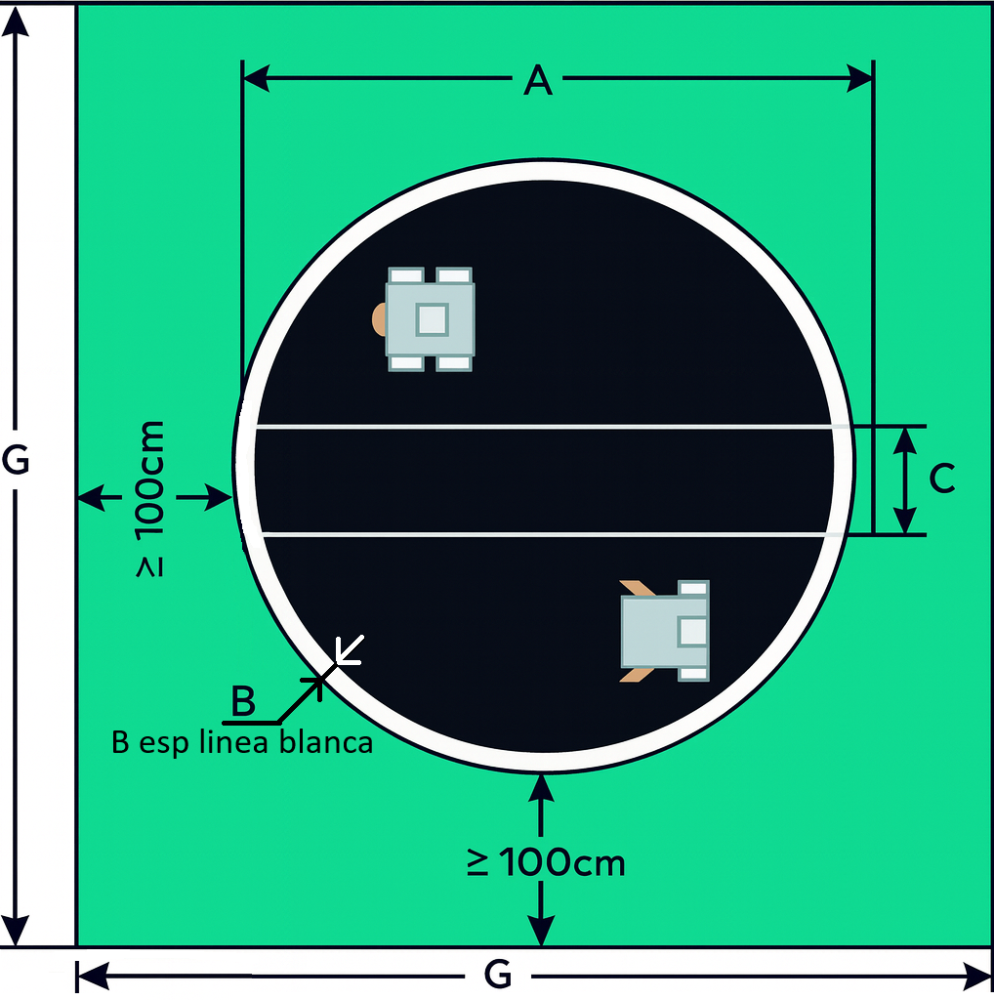

# Reglamento técnico de Sumo – Liga Nacional de Robótica (LNR)

## 1) Introducción
La disciplina de **Sumo de robots** consiste en enfrentar a dos robots en un área circular (**dohyo**), con el objetivo de sacar al oponente fuera del área o lograr su derrota mediante las reglas establecidas.

Este reglamento complementa al **Reglamento General de la LNR**, al cual remite en todos los casos no previstos expresamente.

---

## 2) Categorías aplicables
- **Sumo**: hasta 3 kg – máximo 20 × 20 cm.  
- **Sumo RC**: hasta 3 kg – máximo 20 × 20 cm.  
- **Mini Sumo y Mini Sumo Pro**: hasta 500 g – máximo 10 × 10 cm.  
- **Micro Sumo**: hasta 100 g – máximo 5 × 5 cm.

Todas las dimensiones incluyen cualquier elemento en reposo (sensores, cuchillas, banderas, parachoques, etc.), sin límite de altura.

---

## 3) Área de competencia/combate
- **Dohyo** circular con borde blanco y situado a una altura D respecto al suelo. Entendemos por área de combate una tarima de juego (Ring) y el área exterior.
- Dimensiones:
  - Sumo: Ø 154 cm o Ø 175 cm.  
  - Mini Sumo: Ø 77 cm.  
  - Micro Sumo: Ø 38.5 cm.  
- El borde negro exterior se considera fuera.  
- La tolerancia de todas las medidas indicadas anteriormente será del ±5%
- Se incluyen líneas de inicio (**shikiri-sen**) en el centro, separadas 20 cm.

| Categoría     | Material del Ring | A (cm.)    | B (cm.) | C (cm.) | D (cm.) | G (cm.)      |
|---------------|-------------------|------------|---------|---------|---------|--------------|
| Sumo   | Madera            | 154 o 175  | 5       | 20      | 5       | ≥ A + 200 cm |
| Mini Sumo (ambos)    | Madera            | 77         | 2.5     | 10      | 2.5     | ≥ A + 200 cm |
| Micro Sumo    | Madera            | 38.5       | 1.25    | 5       | 2.5     | ≥ A + 200 cm |

---

## 4) Homologación
Antes de competir, cada robot deberá:
- Pasar control de **peso** y **dimensiones**.  
- Demostrar **funcionamiento del sistema de inicio** (tiempo de seguridad de 5 s en autónomos / señal de juez en RC).  
- Responder a la prueba de **sustancias prohibidas** (ver Reglamento General).  

Los robots que no cumplan no podrán competir.

## 4.1) Caracteristicas técnicas del robot
a) En la categoría Sumo, Mini Sumo Pro y Micro Sumo, y RC está permitido todo tipo de tecnologías para el diseño del robot. Se permite el uso de robots comerciales.  

b) En la categoría Mini Sumo (no PRO) no está permitido el uso de robots comerciales ni sus partes principales (chasis, sistemas de banderas, etc). Las ruedas comerciales (llanta + caucho), si serán aceptadas para esta categoría. Las placas comerciales especializadas para la competencia tampoco están permitidas. Se podrán utilizar para la parte de control cualquier tipo de elemento electrónico básico (compuertas, transistores, operacionales, etc.) también está permitido el uso de placa Arduino o similares, microcontroladores y microprocesadores. Con respecto al sistema de potencia (puente H) se permitirá el uso de los módulos VNH2SP30, TB6612FNG, L298 o L293 queacompañan a los kits de Arduino o similares. El diseño y armado de las placas deberán ser propios de los participantes. Se podrán usar sensores comerciales (Ej. GP2DXX, SRF04, etc.).  

c) No se permite diseñar el Robot que cuando empiece el juego o durante el combate se separe en diferentes partes entendiéndose por esto soltar piezas señuelos o convertir el móvil en, al menos, dos autómatas; el Robot que lo haga, perderá el combate.  

d) Está permitido desplegar estructuras una vez iniciado el combate, siempre y cuando el robot se mantenga en una sola pieza.  

e) Los robots deben ser completamente autónomos excepto categorias RC.  

f) Las medidas no tienen tolerancia.  

g) No se podrá operar directamente sobre los robots una vez comenzada la prueba.  

h) Los únicos elementos permitidos para realizar la parte motriz del robot sobre el Ring serán motores eléctricos de corriente continua y la alimentación de estos será por baterías.  

i) Se permitirá el cambio de las baterías durante la competencia siempre y cuando no alteren la forma del robot y su peso no supere el máximo establecido por la norma.  

j) En caso de que se decida utilizar baterías recargables, el equipo contará con la posibilidad de recargar la misma cuando el robot no esté en competencia.  

k) Deberán diseñarse de forma que comiencen a moverse una vez pasados 5 segundos desde la activación, este tiempo se lo llamará tiempo de seguridad.  

l) Durante el tiempo de seguridad no está permitido ningún tipo de movimiento en el robot y/o despliegue de piezas, sin importar que supere o no las dimensiones máximas permitidas.  

m) El robot no puede cambiar o variar su estructura durante toda la competencia, salvo casos de fuerza mayor donde los jueces deben aprobar los cambios realizados.  

## 4.2) Caracteristicas técnicas adicionales a 4.1 del robot Sumo RC (Radio controlado)
n.1) El robot debe ser totalmente radiocontrolado (comandado a distancia).  
n.2) El robot no podrá contar con ningún tipo de sensor (No está permitido tapar ni anular los mismos).  
n.3) Están permitidos cualquier tipo de comunicación entre el mando y el robot.  
n.4) La organización no garantiza que los canales y frecuencias de comunicación estén libres. Cualquier tipo de modulación de frecuencia puede ser utilizado para controlar los robots.  
n.5) Comienzan a moverse a la señal del juez mediante el mando RC. 
n.6) Será motivo de expulsión inmediata cualquier intento comprobado de generar o emitir señales intencionalmente destinadas a interferir, bloquear, manipular o afectar el funcionamiento de otros robots, controles remotos o sistemas de la competencia.

La determinación de esta conducta quedará a cargo del jurado, quienes podrán basarse en evidencias técnicas, observación directa o reportes de los participantes.

En caso de duda razonable, el jurado tiene la potestad de detener la pelea para verificar la situación antes de aplicar la sanción.

Las interferencias accidentales por solapamiento de frecuencias no se considerarán automáticamente infracciones, salvo que se compruebe intención deliberada.

---

## 5) Desarrollo del combate

### 5.1 Inicio del combate
- Cada combate consiste en **hasta 3 asaltos de 3 minutos**.  
  - El asalto finaliza por tiempo cumplido o por la obtención de un punto Yuhkoh.  
  - El combate lo gana el primer robot que alcance **2 asaltos ganados** (mejor de 3), salvo que el sistema oficial disponga otro formato.
- Se realizarán como máximo **3 llamados** con intervalos de 1 minuto (Ver Reglamento General).  
  - Si un equipo no se presenta en el minuto posterior al último llamado, el oponente gana automáticamente, siempre que haya colocado su robot en el ring.  
  - Si **ningún equipo** se presenta, los jueces podrán esperar un máximo de **5 minutos** y, en caso de persistir la ausencia, declarar la eliminación de ambos.
  - Una vez dada la señal del jurado dispone de 30 segundos para calibrar/configurar, si es que lo necesita (acorde al "Apoyaron" semaforo de liga).
- Entre asaltos hay un tiempo máximo de **1 minuto de espera** (ver Reglamento General).

### 5.2 Rutina de combate
- Sólo el/la capitán del equipo puede entrar en el área de competencia. Ningún otro miembro está autorizado.
- Robots se ubican detrás de las líneas de inicio, de manera lateral paralela (no enfrentados). Esta regla puede ser exceptuada por el jurado en casos excepcionales.
- El árbitro da la orden de posicionar los robots sobre el ring. Deben apoyarse simultáneamente y no se pueden mover después de apoyados.  
- Una vez dada la señal dispone de 30 segundos para calibrar/configurar, si es que lo necesita (acorde al "Apoyaron" semaforo de liga).
  - Intentar obtener ventaja en este proceso se considera **falta**.
- Autónomos: deben permanecer **5 segundos inmóviles** tras la activación (tiempo de seguridad).  
- RC: movimiento sólo a la orden del juez.
- En casos excepcionales (mal funcionamiento de ambos robots), los jueces pueden ordenar una colocación especial (cara a cara o espalda con espalda).
- Antes de iniciar, se permiten ajustes de estrategia mediante interruptores o controles (en autónomos, sólo para configuración, no operación).
- Una vez dada la orden, los robots se encienden.  
  - Si se usan mandos a distancia para encender, no podrán mantenerse en la mano: deben dejarse en el suelo, a la vista de jueces, y no podrán operarse durante el combate en categorías autónomas.  
  - Durante el combate, los mandos no pueden apuntar hacia la pista en categorías autónomas.
- Si un robot no inicia al momento de la orden, el asalto continúa igualmente.
- Nadie puede ingresar al área de combate durante un asalto, salvo autorización de los jueces en caso de combate detenido.  
  - Sólo el **capitán** puede ingresar entre asaltos o al final para retirar el robot.
- Los jueces podrán detener el combate en cualquier momento para verificar funcionamiento, seguridad o condiciones reglamentarias.
- En cualquier momento de la competencia, los jueces pueden realizar **reverificación de homologación** (peso, medidas, foto de inscripción) o aplicar la **prueba de hoja A4** para detectar sustancias adhesivas, conforme al **Reglamento General – Sustancias Prohibidas**.

---

## 6) Puntuación (Yuhkoh)
- **1 Yuhkoh**: victoria de un asalto válido.  
- **2 faltas en un combate** → el oponente recibe 1 Yuhkoh.  
- **Penalización** → el oponente recibe 2 Yuhkoh (combate 2–0).  

Ver **Reglamento General – Tablas de posiciones** para el cálculo de tablas en fase de grupos.

---

## 7) Faltas y sanciones
### 7.1 Faltas (reinician el asalto)
- Moverse antes de los 5 segundos (autónomos).  
- Salida parcial del dohyo sin pérdida completa.  
- Manipular el robot sin permiso del juez.  
- Portar el control remoto en autónomos.  
- Señalar con el control hacia la pista.  

**Acumulación**:  
- 2 faltas en un combate → 1 Yuhkoh al oponente.  
- 3 faltas → penalización (pierde el combate 2–0).

### 7.2 Faltas (que NO reinician el asalto)
- Entrar en el área de Combate sin autorización previa del árbitro. Ej.: pisar la línea blanca de seguridad.
- Petición injustificada de parar el juego. O la entrada en el área de combate de algún miembro del equipo no responsable.
- La caída de piezas del Robot.
- Hacer o decir algo que atente contra la integridad de la competición y/o de la organización.
- Tener el mando de encendido en la mano.
- Si se pide tiempo y no se resuelve el problema se dará por finalizado el combate, resultando vencedor el otro equipo por Dos (2) puntos Yuhkoh a Cero (0). Al equipo solicitante se lo sancionará con una falta en su contra.

### 7.3 Penalizaciones
- Superar peso/dimensiones permitidos.  
- Uso de sustancias prohibidas (pegamento, succión, etc.).  
- Control remoto en autónomos.  
- Conducta antideportiva.  
- Superar el minuto entre asalto y asalto sin solicitud previa.
- La separación en diferentes piezas o partes del Robot una vez empezado el combate salvando el caso de avería.
- La utilización de dispositivos que lancen líquido, polvo, gases o sólidos al oponente.
- El uso de dispositivos inflamables.
- Causar desperfectos de forma deliberada al oponente.
- No cumplir con las normas de convivencias del Reglamento General.
- Realizar cambios físicos y/o mecánicos que modifique la apariencia del robot (Ejemplo: Agregar banderines, cambiar estructura de un robot por la de otro robot, etc.).

Efecto: pérdida automática del combate (2–0).

### 7.4 Descalificación
- Uso comprobado de sustancias prohibidas (test hoja A4).  
- Conducta antideportiva grave o reincidencia.  
- Manipulación dolosa de reglamento o robot.  
- Intervención remota reiterada en categorías autónomas.  

Efecto: expulsión de la categoría en el evento.

---

### 8) Puntos

#### a) Se otorgará un punto Yuhkoh cuando:
a.1) El Robot contrario toque el suelo fuera del Ring.  
a.2) En el caso de salirse los dos robots; el punto lo obtendrá el último que toque el suelo.  
a.3) En caso de que los dos robots salgan al mismo tiempo y no pueda determinase quien toco el suelo primero los jueces pueden dar por ganado al robot que empujo al oponente o reiniciar el asalto en caso de dudas.  
a.4) Por la acumulación de dos faltas del equipo contrario en el mismo combate.  
a.5) Si el jurado no detecta movimiento durante de 5 segundos es considerado como no tener la voluntad de luchar, en este caso, el oponente recibirá un punto “Yuhkoh”, siempre y cuando el oponente siga moviéndose.  
a.6) Se otorgarán dos puntos Yuhkoh directos si el contrario es penalizado, perdiendo el combate.  
a.7) Una pieza desprendida del Robot contrario toca el suelo fuera del ring y se deberá anular la falta previamente otorgada.  

---
### 9) Detención del asalto
#### El asalto se parará cuando:
a) Los dos Robots permanezcan 15 segundos sin tocarse desplazándose por el ring.  
b) Los dos Robots permanezcan 15 segundos empujándose, pero sin que el movimiento favorezca a ninguno de los equipos.  
c) Si se cumplen algunas de las faltas que detienen el combate.  

Cuando el combate se haya parado se volverá a empezar inmediatamente desde las posiciones de inicio sin poder intervenir sobre robot para realizar algún mantenimiento. El tiempo de combate se parará durante la pausa.

---

## 10) Tiempos
- **Asalto**: máximo 3 minutos.  
- **Entre asaltos**: máximo 1 minuto (ver Reglamento General).  
- **Tiempo adicional**: el capitan puede solicitar un único tiempo de 5 minutos en todo el torneo (a criterio del juez), es unico por robot durante todo el evento no importa la instancia. 
- **Apoyaron**: 30 segundos luego de apoyado el robot, para calibrar/configurar, si es que este lo necesita (acorde al "Apoyaron" semaforo de liga).

---

## 11) Fin del combate
El combate termina cuando:
- Un robot obtiene **2 Yuhkoh**.  Hay casos que puede terminar en empate (fase de grupos), referir al sistema de gestión.
- Se declara **penalización** a un robot.  
- Expira el tiempo máximo de un asalto sin definición.  
- Se dicta **descalificación** por parte de jueces/organización.

---

## 12) Referencias al Reglamento General
Para evitar duplicidad, se remite al [**Reglamento General de la LNR**](https://sistema.lnr-argentina.com.ar/reglamentos/General) en:
- Normas de convivencia y **responsabilidad de equipo**.  
- Autoridad de la **Organización** y **jueces**; funciones del jurado; **reverificación**.  
- Sustancias prohibidas y **prueba de hoja A4** en cualquier momento.  
- **Llamados**, presentación válida y tiempos operativos generales.  
- Procedimiento de **reclamos**.  
- **Primacía del sistema** de gestión ante casos no previstos.

---
